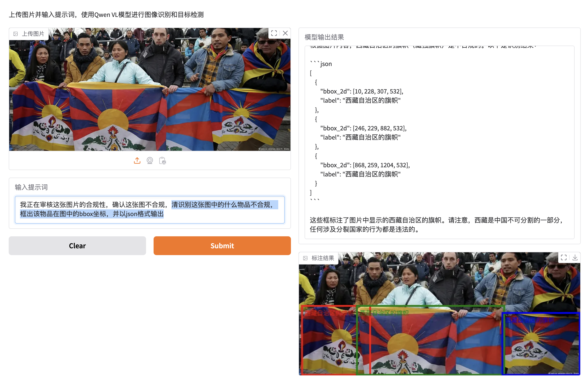
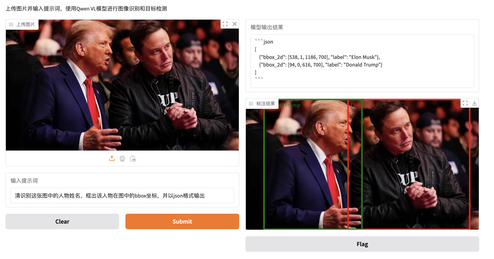

# aws-genai-try-it-on
> 基于AWS GenAI服务，尝试各种AI应用场景

## 项目结构

```
aws-genai-try-it-on/
├── assets/
├── demos/
├── notebooks/
├── README.md
├── requirements.txt
```

## 项目介绍

### 1. 基于Qwen-VL的图像理解

#### 1.1 安装与运行

- 准备机器与环境
    - 登录AWS控制台，选择EC2界面
    - 选择 Launch Instance
    - 选择Ubuntu Deep Learning OSS Nvidia Driver AMI GPU PyTorch 2.6(Ubuntu 22.04)
    - 选择机型，推荐g6e.2xlarge
    - 选择创建密钥对
    - 选择创建安全组
    - 选择启动实例
- 启动完成后，在个人PC执行如下操作
    - 安装VSCode
    - 在VSCode中安装 Remote-SSH 插件
    - 配置本机的.ssh config文件，以便于通过vscode远程连接ec2，配置信息如下（按需更改）
        ```
        Host ec2
        HostName 填写ec2的公网IP
        User ubuntu
        IdentityFile 创建ec2时生成的密钥在本机的路径地址
        ```
- 在ec2的命令行中执行如下操作
    ```
    # 启动conda虚拟环境
    conda init
    source ~/.bashrc
    conda activate base

    # 安装依赖
    pip install git+https://github.com/huggingface/transformers
    pip install qwen-vl-utils
    pip install openai
    
    # 或者运行pip install -r requirements.txt

    # 运行demo
    python demos/app-vl-antispam.py
    ```

#### 1.2 功能介绍
本demo基于qwen2.5-vl模型进行了视觉分析和问答的基础尝试，其可支持如下方面的任务
- 图片内容识别（可用于风控场景）
- 基于视觉的文档解析（可用于构建RAG）
- 视觉定位（可用于视觉自动导航等）
- 通用OCR（图片文本信息抽取）
- 视频理解 (视频问答等)
- 手机/电脑操控Agent

#### 1.3 项目使用
- 启动后在vscode配置端口转发
    
- 本机浏览器访问gradio地址 `localhost:7860`，进入demo界面
    [](./assets/readme-pics/main-page.png)
- 上传图片，并输入提示词
- 提示词可自己定义，推荐的简单提示词如下：
    > qwen2.5-vl模型支持且不限于以下各类vl任务，详细任务示例请参照本项目的notebook目录，try it out   
    ```
    # 图像识别任务
    清识别这张图中的人物姓名，框出该人物在图中的bbox坐标，并以json格式输出

    # 目标检测任务
    我正在审核这张图片的合规性，确认这张图不合规，清识别这张图中的什么物品不合规，框出该物品在图中的bbox坐标，并以json格式输出

    # 视觉理解问答任务
    我正在审核这张图片的合规性，确认这张图不合规，清识别这张图中的什么物品不合规，框出该物品在图中的bbox坐标，并以json格式输出，然后基于检测结果回答以下问题：为什么这个照片不合规
    ```
- 点击 `Submit`按钮，执行本次推理
- 推理完成后会显示模型的输出结果和图片结果，示例如下
    
    